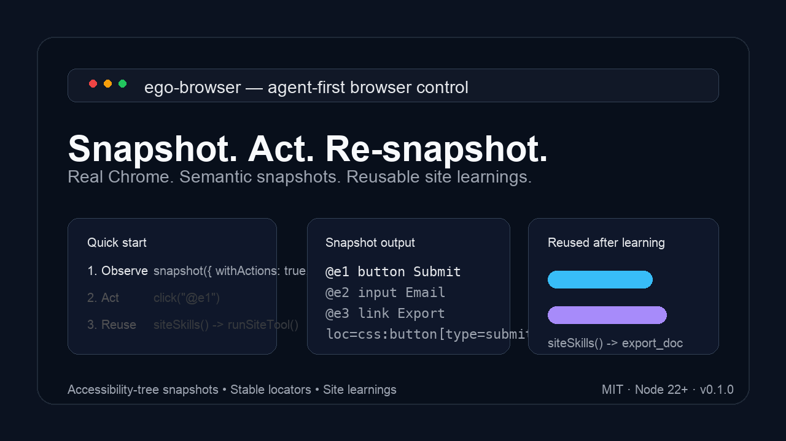
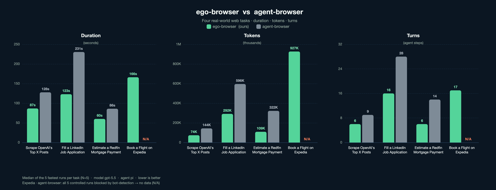

# ego-browser

<div align="center">

[](LICENSE)
[](https://nodejs.org/)
[](https://github.com/CitroLabs/ego-lite/actions/workflows/ci.yml)
[](https://github.com/CitroLabs/ego-lite/releases/latest)




</div>

`ego-browser` is a Chromium-based browser designed from the ground up to be friendly to both human users and AI agents. The browser hosts an `ego` runtime that exposes tabs, CDP, snapshots, and an isolated **task space** per agent. Agents reuse the user's login state without competing for the user's windows.

This repo (`ego-lite`) ships the **Node.js helper runtime and agent skill** that run on top of that browser. It does not contain the browser binary itself — install `ego-browser` separately and this repo provides everything that runs inside it.

## Real-world comparison

We ran `ego-browser` and `agent-browser` head-to-head on four real-world web tasks — each a multi-step flow on a live site, and each stopping short of any irreversible action (no application submitted, no payment made):

- **Scrape OpenAI's top X posts** — rank @OpenAI's original posts from the last 7 days by views, then report the averages across all of them.
- **Fill a LinkedIn job application** — search and filter roles, follow the redirect to the linked Ashby form, upload a résumé, and fill every required field — stopping just before Submit.
- **Estimate a Redfin mortgage payment** — filter Austin single-family listings, set a 20% down payment, and read off the monthly estimate.
- **Book a flight on Expedia** — find the cheapest nonstop JFK→MIA fare and fill in the passenger details up to the payment page.

Across all four, `ego-browser` finishes faster and uses fewer tokens and fewer steps. On Expedia, `agent-browser` was blocked by bot-detection on every run — so the chart marks it N/A, since there was no completed run to compare against.

<div align="center">



</div>

## What's in this repo

- `package/ego-browser/` — Node.js helper runtime. Bundles to a single `artifacts/ego-browser/index.js` that the browser invokes via `ego-browser nodejs <<'EOF' ... EOF`.
- `skills/ego-browser/` — agent skill (`SKILL.md`, `SKILL.zh.md`) and reusable site learnings under `learnings/{github,google,x-com,...}/`.
- `.claude-plugin/marketplace.json` — exposes the skill as a Claude Code plugin (`browser-skills`).

## Quick start

Inside the ego-browser browser, drive a page with a heredoc:

```bash
ego-browser nodejs <<'EOF'
const task = await useOrCreateTaskSpace('open example')

await openOrReuseTab('https://example.com', { wait: true, timeout: 20 })
cliLog(await snapshotText())

await completeTaskSpace(task, { keep: true })
EOF
```

Each heredoc runs in a fresh Node process with all helpers pre-imported. State persists in the browser (task space, tabs, login), not in the Node process — so every heredoc must re-call `useOrCreateTaskSpace(name)` to rejoin the same space.

## Core loop

```bash
ego-browser nodejs <<'EOF'
const name = 'demo'
await useOrCreateTaskSpace(name)

await openOrReuseTab('https://example.com', { wait: true })
cliLog(await snapshotText())          // refs like @1, @2, ... are reassigned every snapshot

await click('@3')
cliLog(await snapshotText())          // re-observe after any action
EOF
```

Snapshot refs (`@N`) are short-lived. Re-snapshot after navigation, clicks, or dynamic re-render. For values that must survive runs, keep the `loc=...` field from the snapshot or use a stable CSS / ARIA locator.

## Helper surface

All helpers are pre-imported into the heredoc scope. Use `cliLog(help('name'))` for usage.

| Group | Helpers |
| --- | --- |
| Task spaces | `listTaskSpaces`, `useOrCreateTaskSpace`, `handOffTaskSpace`, `takeOverTaskSpace`, `waitForAgentControl`, `completeTaskSpace` |
| Tabs / navigation | `listTabs`, `currentTab`, `switchTab`, `newTab`, `openOrReuseTab`, `gotoUrl`, `gotoAndWait`, `pageInfo`, `ensureRealTab`, `iframeTarget` |
| Observation | `snapshot`, `snapshotText`, `snapshotRaw`, `captureScreenshot`, `elementCenter`, `drainEvents` |
| Pointer / scroll | `click`, `doubleClick`, `hover`, `dragMouse`, `scrollBy`, `scrollToBottomUntil`, `scroll({ dx?, dy? })` |
| Keyboard / input | `typeText`, `fillInput`, `pressKey`, `dispatchKey`, `uploadFile` |
| Waits | `wait`, `waitForLoad`, `waitForElement`, `waitForNetworkIdle` |
| Fetch | `httpGet` |
| CDP / evaluate | `js`, `elementEval`, `cdp` |
| Site learnings | `siteSkills`, `siteSkillsForUrl`, `runSiteTool`, `runSiteBrowserTool`, `learnContext` |
| Output | `cliLog`, `help` |

`cliLog` is the only output channel inside a heredoc — all results the agent should see must go through it.

## Task spaces and control handoff

A **task space** is an isolated browsing context with its own tabs, but inheriting the user's login state. Multiple agents and the user can operate concurrently without stepping on each other.

Only one side (agent or user) holds control of a task space at a time:

```js
await handOffTaskSpace(name)         // give control to the user (e.g. for login/captcha)
cliLog('Please complete the login')

await waitForAgentControl(name)       // block until user returns control
// ...continue working
```

`takeOverTaskSpace(name)` is the explicit way to reclaim control after the user says "continue" in chat. `completeTaskSpace(name, { keep })` is called **only in the final heredoc round** — `keep: false` closes the space, `keep: true` leaves the page visible.

See `skills/ego-browser/SKILL.md` for the full protocol.

## Site learnings

Reusable site knowledge lives under `skills/ego-browser/learnings/<site>/`:

- `manifest.json` — site metadata, domain matching, declared tools.
- `notes/` — entry points, structural notes, caveats (markdown).
- `tools/*.js` — Node-side tools.
- `browser-tools/*.js` — page-context tools.

Before starting work on a site, check what is already known:

```bash
ego-browser nodejs <<'EOF'
await useOrCreateTaskSpace('survey')
await openOrReuseTab('https://github.com', { wait: true })
cliLog(await siteSkills())
EOF
```

Validate learnings before submitting:

```bash
cd package/ego-browser
npm run validate:site-skills    # alias: validate:learnings
```

## Development

All commands run from `package/ego-browser/`:

```bash
npm ci
npm run build                 # bundle to artifacts/ego-browser/index.js
npm test                      # build + tsc --noEmit + node --test
npm run validate:site-skills
```

CI publishes the bundled `artifacts/ego-browser/index.js` to the GitHub `latest` release on every push to `main`.

Key sources (TypeScript, under `package/ego-browser/src/`):

- `run.ts` — CLI entry; reads stdin and executes as an async function body.
- `helpers.ts` — public helper surface re-exported into the script scope.
- `browser-runtime.ts` — bridge to the in-browser `ego` runtime (CDP, sessions, events).
- `driver/pointer.ts`, `driver/observe.ts`, `driver/keyboard.ts` — interaction primitives.
- `element-resolver.ts` — resolves `@N`, CSS, XPath, and ARIA/role targets.
- `learning/` — site learnings discovery, domain checks, manifest validation.

## Design principles

- The browser owns the world (tabs, CDP, sessions, events). The Node CLI is a thin helper layer.
- Prefer accessibility-tree snapshots and stable locators over pixel coordinates.
- Snapshot refs are short-lived; re-observe after every meaningful action.
- Public helpers are camelCase only.
- Site learnings must be verifiable. No secrets, no pixel coordinates, no flow narration.

## License

MIT © 2026 CitroLabs
